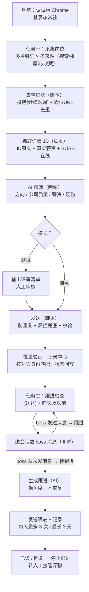

# BOSS直聘 AI 求职自动化 — 三段式流程方案

> 版本：v0.4  
> 状态：**核心流程已实现并实测**（采集/筛选/生成/发送/验证/跟进判断均已跑通）；个人画像与参数抽离到 profile.yaml，一键编排等路线图项待实现  
> 说明：本文档面向所有使用者；个人化配置统一放在 profile.yaml，本仓库不包含任何真实个人数据。文末附"开始使用前需要准备的信息"表。

---

## 1. 背景与目标

### 1.1 现状

- 每天手动在 BOSS 直聘上搜索、浏览岗位、读 JD、编辑自我介绍、打招呼；
- 沟通漏斗：**150 沟通 : 80 已读 : 30 发简历 : 1 面试**（约 0.67% 转化）；
- 自我介绍只有 1-2 个模板，反复使用，已读不回复的比例高；
- 一个人一天只能沟通 20-30 个岗位，大量时间花在"浏览 + 编辑"上。

### 1.2 目标

把以下环节交给 AI：

1. **搜索浏览**：筛选与需求最相关的岗位；
2. **生成**：根据每份 JD 生成个性化的一句话介绍；
3. **发送**：自动发给岗位发布者；
4. **跟进**：消息送达但未读的岗位，T+1 天自动跟进发送消息；
5. **接管**：有回复后，人工接管推进下一步。

### 1.3 硬约束

- **账号安全第一**：绝不为了效率拿求职账号冒险；
- **效率可量化**：每日主动操作控制在 15 分钟左右，AI 消耗可控。

---

## 2. 为什么是"三段式"？（路线评估）

之前实测过一条低效路线，并对比了其他方案：

| 路线 | 效率 | 封号风险 | 结论 |
|---|---|---|---|
| 脚本直调内部 API | 高 | **最高**（请求签名风控，最易触发封禁） | 排除 |
| computer-use / control-chrome 全视觉驱动 | **极低**（实测 40 分钟、token 爆炸） | 中（行为像人，但太慢） | 排除 |
| 三段式（DOM 提取 + AI 批量生成 + 脚本执行） | 高 | 可控（真人节奏 + 确认制） | **采用** |

### 低效路线的根因

"看屏幕 → AI 思考 → 点击"的循环，每一步都消耗一次视觉识别和决策 token。看 10 个岗位、发 10 条消息，就是几十轮循环。  
**正确的分工：AI 只做"读文字、写内容"，所有重复操作交给确定性脚本。**

---

## 3. 总体架构



---

## 4. 第 0 层：基础设施（一次性搭好）

### 4.1 调试版 Chrome

- 独立资料目录启动，带本地调试端口（`--remote-debugging-port` + `--user-data-dir`）；
- BOSS 直聘登录态常驻在该配置中，**不需要反复扫码**；
- 与日常使用的 Chrome 互不干扰，可并存。

### 4.2 脚本命令组（通过调试口连接浏览器）

| 命令 | 作用 |
|---|---|
| `配置校验` | 校验 profile.yaml 并查看过滤规则 / AI 提示词（`node scripts/load-config.mjs --check / --filters / --prompt`） |
| `看岗位 <关键词>` | 按筛选配置从搜索页 / 推荐页批量提取岗位列表 |
| `看JD <岗位>` | 打开详情页提取完整 JD |
| `看沟通` | 提取沟通列表及状态（送达/已读/已同意等） |
| `看回复` | 只挑出新消息的会话 |
| `话术质检` | 检查开场白同质化与规则符合度（`node scripts/validate-openings.mjs <评审文件>`） |
| `发送 <岗位> <内容>` | 填入并发送（或由人工回车确认） |

### 4.3 数据边界

- 所有数据只在本机浏览器和脚本之间流转；
- 若由 AI 在对话内处理，数据不离开当前对话；
- 脚本不向任何第三方服务器上报数据。

### 4.4 如何启动"带登录态的调试版 Chrome"

登录态保存在 profile.yaml 的 `chrome.user_data_dir` 指定的独立资料目录（由使用者自行配置，如 `~/boss-zhipin-chrome`），关闭窗口、重启电脑都不会丢失。三种方式：

**方式零：脚本一键启动（推荐）**

```bash
node scripts/launch-chrome.mjs
```

由 AI 或使用者执行同一脚本：自动检查端口 → 未运行则按 profile.yaml 的 `chrome` 配置启动 Chrome → 打开 BOSS 直聘。已运行则直接复用并打开页面。

**方式一：终端命令启动**

```bash
"/Applications/Google Chrome.app/Contents/MacOS/Google Chrome" --remote-debugging-port=9222 --user-data-dir=<你的资料目录>
```

将 `<你的资料目录>` 换成 profile.yaml 中 `chrome.user_data_dir` 配置的路径。

**方式二：桌面一键启动器（可选）**

在终端执行以下命令，会在桌面生成"打开BOSS直聘"图标，以后双击即用（请先替换 `<你的资料目录>`）：

```bash
printf '#!/bin/bash\n"/Applications/Google Chrome.app/Contents/MacOS/Google Chrome" --remote-debugging-port=9222 --user-data-dir=<你的资料目录>\n' > ~/Desktop/打开BOSS直聘.command && chmod +x ~/Desktop/打开BOSS直聘.command
```

说明：

- 打开后是一个普通 Chrome 窗口（独立资料），可正常浏览，与日常 Chrome 并存互不影响；
- AI 连接的前提：该窗口以带端口方式启动并保持运行；关掉后重新启动即可恢复；
- 万一会话过期需要重新登录，扫码一次即可，之后会继续保存。

> 注：`launch-chrome.mjs` 与方式一/方式二等价，只是把启动动作固定成脚本，路径与端口来自 profile.yaml 的 `chrome` 配置节。

---

## 5. 阶段一：批量提取（秒级，几乎零 token）

**核心原则：直接从网页 DOM 抽取文本，绝不使用截图和视觉识别。**

### 5.1 提取内容

- **岗位列表**：岗位名、公司、薪资、城市、经验要求、JD 链接（一次 20-30 条，每条压到一两行）；
- **完整 JD**：岗位详情页全文；
- **沟通列表**：对方（HR 姓名 / 职位 / 公司）、状态（已送达 / 已读 / 已同意 / 简历已发）、最后一条消息、时间。

### 5.2 成本与风险

- 耗时：每个命令 2-5 秒；
- AI 消耗：约 0（纯本地脚本）；
- 风险：约等于零（等价于自己浏览网页，纯读操作）。

### 5.3 岗位筛选：条件怎么设置、能不能直接用"目标岗位"

**结论：能，分两种来源。**

**来源 1：直接复用使用者在 BOSS 直聘里设置的"目标岗位 / 求职意向"**

- 脚本打开"职位 / 推荐"页（基于求职意向生成的推荐流），直接从推荐流提取岗位；
- 也可以在搜索框输入目标岗位关键词进行搜索。

**来源 2：常驻筛选配置 + 每次临时参数**

脚本读取 profile.yaml（见下），先用代码规则过滤，再用 AI 二次精筛。改条件只需编辑该文件、不用改脚本。

**多关键词采集与去重（已实现）**

- 一次可配置多个搜索关键词（如"电商运营, 京东运营, 数据分析"），脚本逐个搜索并合并；
- 去重规则（脚本，非 AI）：
  1. 搜索卡片按钮为"继续沟通"的岗位**一律排除**——表示该 boss 已经沟通过（同一岗位或同 boss 其他岗位）；
  2. 同一岗位 URL 被多个关键词搜到，**只保留一次**；
  3. 收藏页按"单条薪资"特征过滤混合卡片。

**岗位来源渠道（均已验证或可做）**

| 渠道 | 状态 | 说明 |
|---|---|---|
| 搜索（关键词 × 城市） | ✅ 已通 | 多关键词、可翻页 |
| 职位推荐流 | ✅ 可做 | 基于求职意向的推荐页 |
| 个人中心"对我感兴趣的" | ✅ 已通 | 主动感兴趣的 HR 及其岗位 |
| 个人中心"我感兴趣的岗位"（收藏） | ✅ 已通 | URL：`recommend?tab=4&sub=1&page=1&tag=4`，薪资明文可读 |
| 沟通列表 | ✅ 已通 | 历史沟通过的岗位 |

**筛选维度分两层实现（全程无 OCR、无视觉识别、无逐屏 AI 判断）：**

| 层 | 方式 | token 成本 | 覆盖维度 |
|---|---|---|---|
| 第一层：提取 + 代码规则过滤 | 脚本批量抽取岗位卡片文本，用代码按配置过滤（薪资区间、城市、关键词、排除名单等） | ≈ 0 | 薪资、城市、经验、学历、发布时间、BOSS 活跃度（卡片上有的字段）、排除公司等硬条件 |
| 第二层：AI 精筛 | 阶段二对第一层留下的短名单批量打分 | 一次调用 | 技能匹配、JD 契合度、通勤等软条件 |

说明：

- 第一层是纯代码规则：固定条件写死在配置里，每次运行毫秒级完成，**不消耗任何 AI**；
- 只有需要平台自身筛选逻辑（如按 BOSS 活跃度排序）时，才考虑用 URL 参数或脚本点击控件辅助——同样是无视觉的固定 DOM 操作；
- 原则：硬条件尽量下沉到第一层（免费、快、可预期），软条件才交给 AI。

**配置方式（v0.3 起）：**

所有个人化参数集中在项目根目录 `profile.yaml`（复制 `profile.example.yaml` 填写，真实文件已被 .gitignore 排除，不进仓库）：

- **硬过滤与运行字段**（城市、城市代码、薪资区间、排除关键词、已知排除公司名单、JD 硬伤正则、每日/跟进参数、运行模式 `mode: auto/test`）→ 脚本确定性读取并执行，不经过 AI；
- **AI 画像字段**（方向、经历摘要、简历文件、公司入选标准、开场白/跟进话术要求）→ 由 `scripts/config.mjs` 注入 `prompts/screening.md` 提示词模板，生成第二层 AI 的完整指令。

常用命令：

- `node scripts/load-config.mjs --check` —— 校验配置并打印摘要；
- `node scripts/load-config.mjs --filters` —— 查看脚本实际使用的硬过滤规则；
- `node scripts/load-config.mjs --prompt`（或 `--save-prompt <路径>`）—— 查看/保存生成后的 AI 提示词全文。

修改 profile.yaml 后无需改动任何脚本或提示词模板。

---

## 6. 阶段二：AI 精筛 + 生成开场白（一次调用，成本可控）

### 6.0 脚本先批量抓取 JD（AI 不进入浏览器）

- 对第一层留下的短名单（10-20 个），脚本逐个打开岗位详情页，抽取"岗位职责"全文，保存为文本；
- **脚本负责"进页面"，AI 只负责"读文字"**——全程无视觉识别、无逐页 AI 判断；
- 详情页顺带抽取：**真实薪资**（详情页为明文，列表页的字体反爬在此无效）、**BOSS 在线状态**、**公司基本信息**（轮次 / 规模 / 行业）；
- **发布时间**：web 端（列表页与详情页）均不显示岗位级发布时间，暂不处理；
- 成本：脚本毫秒级；AI 只消费最终文本。

### 6.1 AI 逐岗判断（依据画像）

对每份 JD 输出一个结论：

- ✅ **符合** → 进入 6.2 生成开场白；
- ❌ **不符合** → 忽略退出（记录一行原因，不发送任何内容）。

**判断标准清单**（依据画像文件里的求职要求）：

1. 岗位方向是否在目标范围内；
2. 核心职责是否与技能/经历匹配；
3. 薪资、城市、经验、学历是否符合底线；
4. 无明显硬伤（如外包性质、销售导向、倒班等）。

**代运营公司判断（AI 层，无法硬过滤）**：代运营=乙方运营服务商（没有自有品牌、承接品牌方电商运营/投放/客服项目），一般不体现在公司名和 JD 职责里，由 AI 结合公司简介与业务模式判断（信号见提示词模板）；已知的代运营公司名可随时加入 profile.yaml 的 `exclude_companies` 名单，命中后脚本确定性排除，形成"名单 + AI 兜底"的闭环。

**收藏岗位例外**：收藏来源（使用者在 BOSS 直聘中收藏的岗位）为使用者亲自挑选，配置 `favorites_skip_screening: true` 后，采集脚本跳过全部硬过滤，AI 跳过匹配判断，直接为每个收藏岗位生成开场白并沟通（仍保留"继续沟通"排除与 URL 去重，防止重复打扰）。

### 6.2 输入

1. **个人画像**（profile.yaml 的 `profile` 节点，经 `load-config` 注入提示词模板）：
   - 经历摘要与简历文件、公司入选标准、话术风格要求（见 `node scripts/load-config.mjs --prompt` 生成的完整指令）；
   - 底线：目标岗位方向、城市、薪资、排除公司/行业。
2. **阶段一提取的数据**（岗位卡片 + 6.0 抓取的完整 JD）。

### 6.3 产出

1. **逐岗结论**：符合 / 不符合 + 一句话理由；
2. **开场白**：只对"符合"的岗位生成，**每条命中该 JD 的核心职责**，配上经历中对应的证据，不重复模板；
3. **跟进判断**（可选）：标出"消息[送达]未读且时间为昨天及以前、且 boss 从未发过消息"的会话，生成内容不同的轻量提醒草稿。

### 6.4 输出示例（评审清单）

```text
#1 某知名消费品牌·电商运营经理  20-30K·上海  匹配 9/10
理由：要求天猫/京东自营操盘+爆品经验 → 候选人有 3 年自营运营、牵头类目 TOP3 单品
招呼语：3年电商运营，操盘千万级天猫旗舰店，牵头类目TOP3单品，
熟悉直通车/万相台投放，大促期推动ROI提升25%，期待和您详细沟通。
状态：待人工确认

#2 某外包公司·运营专员  10-15K·上海  不匹配
理由：外包性质 + 岗位偏执行客服，不符合底线
状态：忽略
```

### 6.5 成本

- 这是全流程主要消耗 AI 的地方，但**一次性处理整批**；
- 例：读 15 份 JD、筛出 8 个符合、写 8 条开场白，一次对话完成，成本远低于逐页识别方式。

### 6.6 开场白写作要求（默认规则，可在 profile.yaml 的 opening_style 中调整）

1. **开头不用"您好"等寒暄**，开门见山——BOSS 的消息列表预览只显示前十几个字，开头必须放最有价值的匹配信息；
2. **全文约 200 字，必须有数据支撑**（GMV、年限、单品排名、ROI 等具体数字），不说空话、不笼统；
3. **结尾不用"想聊聊xxx的挑战"这类不知所云的表达**，用明确的价值收束或行动引导。

---

## 7. 模式：测试 / 自动

流程以配置文件中的 `mode` 字段切换：

> `mode` 配置在 profile.yaml：`auto`=直接发送，`test`=先审核（推荐先用 test 验收筛选与话术质量）；使用者可临时口头覆盖。

**测试模式（`mode: test`，用于调试 AI）**

- 输出完整的评审清单：筛选出的岗位 + 每条开场白 + 判断理由；
- 人工过目、删改、调措辞；不满意的地方反馈后调整画像 / 提示词，反复迭代；
- **不发送任何消息**。

**自动模式（`mode: auto`，正式运行）**

- 跳过人工确认，直接进入发送环节；
- 兜底规则：AI 置信度低、JD 信息不全、或触发风控信号的岗位**一律跳过不发送**，记入日志供事后查看；
- 严格受控：每日上限、随机间隔、遇验证码即停。

**两种编排形态**

| 形态 | 说明 | 现状 |
|---|---|---|
| A：对话内跑 | AI 在会话中按固定顺序执行全流程（采集→精筛→生成→发送→验证→跟进） | 当前采用；一键编排待实现 |
| B：无人值守 | 脚本接 LLM API，定时自动跑完一天 | 待接入 LLM API 后实现 |

---

## 8. 阶段三：执行发送（分钟级，几乎零 token）

### 8.1 发送形态

自动模式下：脚本逐个打开岗位 → 填入开场白 → 按随机间隔（30-90 秒）自动发送，全天摊开。

### 8.2 硬性红线

- 真实点击页面按钮，**绝不调内部接口**；
- 每条内容不同（已生成，天然不同）；
- 控制在每日打招呼额度内（以平台实际上限为准）；
- **发送前查重**：本地记录已有相同内容则跳过，绝不重发；
- **风控兜底**：发送前后检测验证码/滑块等特征，一旦出现立即停止本轮、标记"风控拦截-待人工"；
- **对方身份从消息列表页读取**（姓名+公司+职位完整），用于事后按身份匹配验证；
- 低置信度 / 信息不全的岗位跳过不发送；
- 发送后写入本地记录中心，防止重复。

---

## 9. 每日循环设计（任务一 + 任务二）

每天循环执行两个任务，共用一份"本地记录中心"。

### 9.1 任务一：当天的新沟通

1. 按筛选配置提取岗位 → 代码规则过滤 → 短名单；
2. 脚本批量抓取短名单 JD；
3. AI 逐岗判断：符合 → 生成开场白；不符合 → 忽略退出；
4. 测试模式：输出清单人工确认；自动模式：直接进入下一步；
5. 脚本按真人节奏自动发送；
6. 发送结果写入本地记录中心，并同步到沟通记录表格。

### 9.2 任务二：跟进（未读 / 已读不回）

1. 扫描消息列表（**不依赖本地记录**，使用者手动投递的岗位同样能识别），找出满足跟进条件的会话：
   - 状态为"已送达未读"或"已读未回复"；
   - 距上次我方消息发送时间 ≥ 1 天；
   - 连续跟进未读最长 3 天（第 4 天仍未读则停止跟进）；
2. **进会话二次判断（脚本）**：打开候选会话，数消息气泡归属——**boss 侧消息数 = 0 才算待跟进**；只要 boss 曾发过消息（已有一轮沟通），即跳过，避免骚扰；
3. AI 生成跟进消息，**必须与上次内容不同**：输入上次内容与岗位 JD，换一个 JD 要求 + 换一段简历证据（补充数据点 / 回应 JD 新信息 / 问一个开放问题）；
4. 测试模式：人工确认后发送；自动模式：直接发送；
5. 发送结果写入发送记录（底数据存档）。

### 9.3 本地记录中心（实现"循环"的关键）

每条对外消息记录：岗位、对方、发送时间、发送内容、状态变化（送达 → 已读 → 回复）。

- 判断"未读多少天"靠发送时间 + 当前状态；
- 保证"内容不重复"靠保存历史内容，生成时读入对比；
- 防止对同一岗位重复发送。
- **不设独立的跟进记录**：跟进次数由发送记录中该对方的消息条数推断（含开场白共 ≥4 条即停止），支撑"最多 3 次 / 最长 3 天"；
- **不做状态回写**：发送记录只保留"底数据"存档用途（发送时的确认状态），送达/已读/回复的持续跟踪由使用者自行查看。

**沟通记录表格**（自动生成，随发送实时更新）：

| 字段 | 说明 |
|---|---|
| 日期 | 发送日期 |
| 公司 | 公司名称 |
| 岗位名称 | 岗位标题 |
| 薪资 | 岗位薪资 |
| 职位详情 | 该岗位完整 JD |
| 开场白内容 | 实际发送的开场白 / 跟进消息 |
| 对方 | HR 姓名 + 职位 |
| 链接 | 岗位详情页 URL（便于回溯） |

输出为 Excel/CSV 文件，可用表格软件筛选排序；职位详情列保留完整 JD 便于回溯。**此表定位为"沟通岗位底数据存档"，不做跟进次数/状态跟踪。**

### 9.4 每日循环的形态

- 现阶段：每天手动触发（对 AI 说"开始今天的"，AI 自动运行 `launch-chrome.mjs` 启动浏览器；或双击启动器），任务一、任务二顺序执行；
- 未来可选：无人值守定时（需电脑开机 + 调试窗口常驻），先跑稳手动模式再说。

### 9.5 现实约束（务必知晓）

1. **每日发送目标（默认值，可在 profile.yaml 调整）**：100 个开场白 / 天 = **当天筛选出并发送 100 条**，不是采集 100 个岗位再挑；采集原始池按 `daily_target × collect_pool_ratio`（默认 300）预留余量。脚本按目标执行；若平台当日额度先耗尽导致发送失败，记录后停止，不重试、不绕过；
2. **对未读者追发的尺度（默认值，可在 profile.yaml 调整）**：间隔 1 天，未读即跟进，最长连续 3 天，之后停止；所有跟进消息内容不与上次重复。

---

## 10. 回复查看与接管

- **回复查看由使用者自理**（默认不做自动提醒）；
- 有回复后人工接管深聊（约面试、谈薪），AI 只做起草助手。

---

## 11. 一天的时间账

| 环节 | 耗时 | AI 消耗 |
|---|---|---|
| 阶段一 提取 | 20 秒 | 约 0 |
| 阶段二 生成 | 1-2 分钟 | 一次批量调用 |
| 确认（仅测试模式） | 5-10 分钟 | 约 0 |
| 阶段三 发送 | 3-5 分钟（或全天摊开） | 约 0 |
| 白天看回复 | 每次 10 秒 | 少量 |
| **合计** | **测试模式约 15 分钟 / 自动模式约 5 分钟** | **远低于视觉驱动方式** |

---

## 12. 明确不做的事

- ❌ 不调 BOSS 直聘内部 API（封号风险最高）；
- ❌ 不绕过验证码、不超每日额度；
- ❌ 不向"已送达未读"的 HR 无限追发——默认规则：间隔 1 天、最长连续 3 天、之后停止（内容不重复，可在 profile.yaml 调整）；
- ❌ 不在公司电脑 / 公司网络使用（有上网行为监控风险）。

---

## 13. 账号风险框架

### 13.1 风险分级

| 操作 | 风险 | 说明 |
|---|---|---|
| 读（搜索、看 JD、看沟通） | 低 | 等价于正常浏览 |
| 发（打招呼、发简历） | 中 | 风险集中在频率、机械模式、绕过限制 |
| 直调接口 / 绕过验证码 | 最高 | 直接撞风控签名，最易封号 |

### 13.2 缓解措施

- 真实浏览器 + 真实登录态 + 真人节奏（随机间隔、全天摊开）；
- 每日额度内操作；
- 自动模式下：低置信度跳过、异常即停；
- 遇风控立即停止；
- 保持内容多样性（每条招呼语不同）。

> ⚠️ 没有任何方案能保证 100% 不封号。以上措施只是把风险降到可控范围。若极度保守，可用小号试水。

---

## 14. 配置文件说明（profile.yaml）

所有个人化参数集中在项目根目录 `profile.yaml`（复制 `profile.example.yaml` 填写；真实文件已被 .gitignore 排除，不会进入仓库）。AI 精筛与话术生成使用的完整提示词由 `node scripts/load-config.mjs --prompt` 生成；修改 profile.yaml 后无需改动任何脚本或提示词。

| 类别 | 字段 | 说明 |
|---|---|---|
| 基本信息 | user_name | 使用者称呼，仅用于记录 |
| | city / city_code | 目标城市名与 BOSS 直聘城市代码 |
| 目标岗位 | target_jobs | 目标岗位方向 |
| | search_keywords | 采集用搜索关键词（可多个） |
| 硬过滤 | salary_strict / salary_relaxed | 严格薪资档与放宽档（单位 K，下限达标即可） |
| | exclude_keywords | 排除公司/行业关键词 |
| | exclude_companies | 已知需排除的公司名单（命中即排除） |
| | jd_hard_exclude | JD 硬伤正则（如"需base其他城市"） |
| | favorites_skip_screening | 收藏岗位是否跳过筛选、直接生成开场白 |
| 每日与跟进 | daily_target / daily_max | 每日目标/上限（目标=当天筛出并发送的条数） |
| | collect_pool_ratio | 采集原始池 = daily_target × 倍数 |
| | followup_* | 跟进间隔天数、最长天数、每人最多消息数 |
| | send_interval_seconds | 批量发送的随机间隔范围 |
| 运行模式 | mode | auto=直接发送；test=先审核 |
| AI 画像 | direction / summary / resume_file | 求职方向、经历摘要、简历文件路径 |
| | company_standards | 公司入选标准 |
| | opening_style / followup_style | 开场白 / 跟进话术风格要求 |
| 浏览器 | chrome.* | Chrome 路径、调试端口、独立资料目录、启动 URL |

---

## 15. 测试策略

| 环节 | 测试方法 | 状态 |
|---|---|---|
| 配置加载与校验 | load-config --check / --filters / --prompt（真实与示例配置各跑一遍） | ✅ 已测 |
| 采集（多关键词/去重） | 多关键词合并跑，验证"继续沟通排除 + URL 去重" | ✅ 已测 |
| JD 原文提取 | 对比详情页与 CSV 内容 | ✅ 已测 |
| 发送链路 | 真实发送 + 脚本校验（输入框清空 + 消息片段出现） | ✅ 已测（4 条） |
| 批量验证 | 跑 verify，按对方身份/消息前缀匹配 | ✅ 已测 |
| 未读检查 | check-unread，与消息列表人工核对 | ✅ 已测（6 条） |
| 跟进判断（数 boss 消息） | 真实会话对比（9 条与人工核对一致） | ✅ 已测 |
| 跟进次数/停止（规则） | 用模拟发送记录验证"≥4 条停止" | ⏳ 待测 |
| 翻页采集 | 第 1 页 vs 前 2 页对比，确认翻页生效且去重正常 | ✅ 已测 |
| 风控兜底 | 模拟/观察：出现验证特征即停、标记待人工 | ⏳ 待测（已实现未实测） |
| 城市硬伤过滤 | 构造含"需base其他城市"的 JD 验证排除（规则已并入 collect.mjs，由 profile.yaml jd_hard_exclude 驱动） | ⏳ 已实现待实测 |

## 16. 进度清单（当前状态）

**已完成并验证**

- [x] 调试版 Chrome + CDP 连接
- [x] 配置化：profile.yaml + config.mjs 加载校验 + 提示词模板生成（真实信息抽离，profile.example.yaml 假数据模板随仓库）
- [x] 采集：搜索 / 推荐流 / 收藏三个来源，多关键词合并，继续沟通排除 + URL 去重
- [x] JD 原文提取（含真实薪资、BOSS 在线、公司信息）
- [x] AI 精筛 + 开场白生成（按 JD 要求 + 简历证据，开门见山/数据支撑/约200字）
- [x] 发送链路（真实发送 4 条验证：查重、风控兜底、校验、记录）
- [x] 批量验证 + 发送记录 CSV
- [x] 未读检查（[送达] + 昨天及以前）
- [x] 跟进消息生成 + 发送（真实会话验证，含遗留会话一次性补查 JD）
- [x] 评审清单 CSV（岗位职责为脚本抓取原文）
- [x] 发送 P0：发送前查重、风控兜底（验证码检测）、对方身份重试读取、窗口置前
- [x] 跟进判断：进会话数 boss 消息（boss 发过 → 跳过），含滚动/置前/真实点击修复
- [x] 跟进判断性能优化：一次导航 + 轮询切换（9 条约 85 秒，50 条预估约 8 分钟）
- [x] 翻页采集：搜索/收藏 page 参数、推荐流滚动加载、跨页去重
- [x] 城市硬伤过滤（JD 含"需base/外派/常驻其他城市"排除，由配置驱动；待真实 JD 实测）

**待实现 / 待测试**

- [ ] 自动模式一键编排（对话内形态 A）
- [ ] 生成方式：对话内 / API（无人值守形态 B）

---

## 17. 路线图（Roadmap）

1. **一键编排（形态 A）**：把日流程（采集 → 精筛 → 发送 → 验证 → 跟进）串成一条命令；
2. **生成方式**：对话内（默认）→ 接入 LLM API 的无人值守形态 B；
3. **跟进全链路实测**：覆盖多日未读 / 已读不回 / 停止跟进等场景；
4. **持续维护**：BOSS 页面结构变更时，同步更新脚本中的 DOM 选择器。

---

## 18. 开始使用前需要准备的信息

开始使用前，使用者需要准备以下信息并填入 `profile.yaml`（参考 `profile.example.yaml` 与下方说明），AI 才能正常配置并运行：

> 下表即 profile.yaml 各字段的说明；填写后运行 `node scripts/load-config.mjs --check` 校验即可。

| 类别 | 需要提供的信息 | 用途 | 说明 / 示例 |
|---|---|---|---|
| **统一配置入口** | profile.yaml（profile.example.yaml 为模板） | 全流程参数 | 硬过滤字段 + AI 画像字段，见文件内注释；load-config --check 校验 |
| **账号与环境** | BOSS 直聘账号登录态 | 访问岗位、发送消息 | 使用者在调试版 Chrome（独立资料目录）扫码登录一次，登录态常驻 |
| | Chrome 环境 | 运行自动化 | 需本机安装 Chrome 136+，用调试命令/桌面启动器启动带调试口的实例 |
| | 电脑与网络环境 | 安全前提 | 建议个人电脑 + 家用网络；公司电脑有上网行为监控风险 |
| | （可选）LLM API Key | 无人值守编排（形态 B） | 若选择脚本自跑，需 DeepSeek 等兼容 API 的 Key；对话内形态不需要 |
| **个人求职画像** | 目标岗位方向 | 搜索关键词 + AI 精筛 | 如：电商运营、数据分析 |
| | 搜索关键词列表 | 多关键词采集 | 3-5 个词，如"电商运营,京东运营,品类运营" |
| | 城市范围 | 硬过滤 | 限某城市 / 接受异地 / 不接受外派 |
| | 薪资范围（严格 + 放宽） | 硬过滤 | 如：15-20K，特别匹配放宽 12-20K |
| | 经验 / 学历要求 | 硬过滤 | 如：不限；或限定 3-5 年、本科 |
| | BOSS 活跃度要求 | 过滤 / 判断 | 如"近 3 天活跃"（web 端仅详情页"在线"标签可获取，粒度有限） |
| | 排除公司 / 行业 | 硬过滤 | 如：外包、教培、代运营 |
| | 公司入选标准 | AI 判断 | 如：小公司但行业内牛，或大公司 |
| **简历与经历素材** | 简历原文 / 经历要点 | AI 生成开场白与跟进 | 工作年限、行业、平台、操盘规模（GMV/店铺数）、核心技能、管理经验、代表数据（ROI/TOP 排名等） |
| | 话术风格偏好 | AI 生成 | 开头是否寒暄、字数（约 200 字）、数据密度、结尾方式 |
| | 跟进话术规则 | AI 生成 | 换角度、不重复（系统默认规则，可调） |
| **流程参数** | 每日目标数量 | 发送量控制 | 如：50 个/天（按自身情况设置） |
| | 跟进参数 | 跟进控制 | 间隔 1 天、最长 3 天、每人最多 3 次 |
| | 运行模式 | 测试 / 自动 | 建议先测试模式验收 AI 质量，再切自动 |
| | 发送节奏 | 拟人化 | 随机间隔范围（如 30-90 秒） |
| | 生成方式 | 对话内 / API | 对话内（默认）；无人值守需 API |
| **数据存放** | 记录文件存放位置 | 存档 | 建议独立目录（如知识库文件夹 / 桌面），含评审清单、发送记录 |
| **使用前确认** | 账号风险知情 | 合规与风险 | 知晓自动化可能违反平台条款、有封号风险，同意自担 |
| | 测试模式验收 | 质量把关 | 先跑测试模式，确认筛选与话术符合预期后再启用自动发送 |

**上手检查单（使用者侧需完成）**：

1. 安装 Chrome（136+）；
2. 配置 profile.yaml 的 chrome 节（Chrome 路径、调试端口、资料目录），运行 `node scripts/launch-chrome.mjs` 启动调试 Chrome；
3. 在调试版 Chrome 中扫码登录 BOSS 直聘；
4. `npm install` 安装依赖；
5. 复制 profile.example.yaml 为 profile.yaml，按上表填写（含简历文件路径）；
6. 运行 `node scripts/load-config.mjs --check` 校验通过；
7. 先跑测试模式验收 → 确认后切自动模式。
